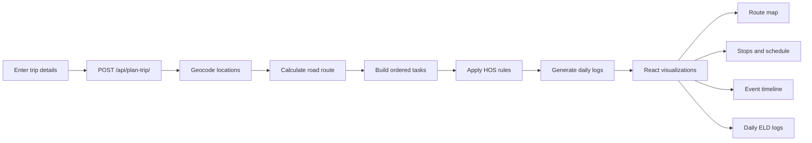
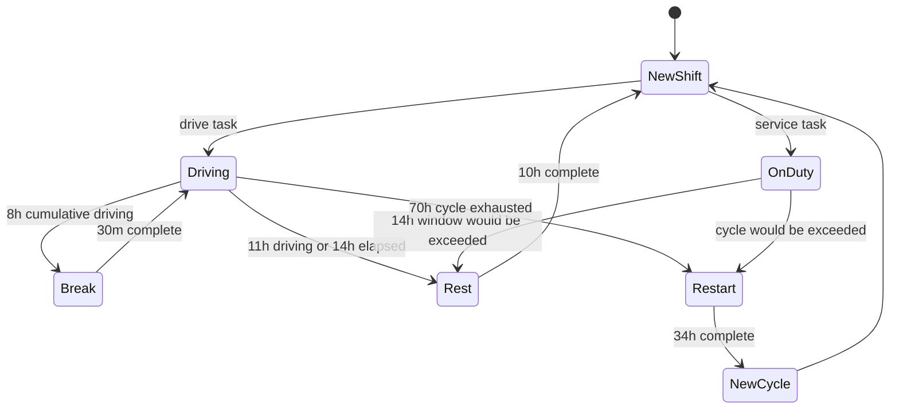
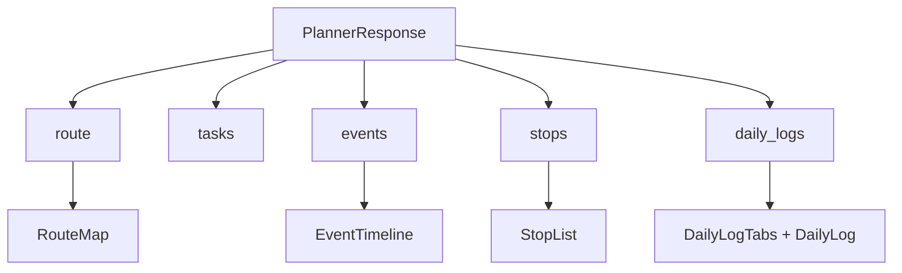

<div align="center">

# Spotter AI

### Trip planning with a deterministic HOS engine

Plan a route, schedule required stops, and inspect the resulting duty record from one full-stack workflow.

<br />

[](#testing)
[](#technology)
[](#technology)
[](#project-status)

</div>

---

## The short version

Spotter AI turns four inputs into one canonical, inspectable trip plan:

```text
Current location + Pickup + Dropoff + Current cycle used
                            |
                            v
                 Django REST planning API
                            |
                            v
             Route -> Tasks -> HOS scheduler -> Daily logs
                            |
                            v
       Map | Stops | Event timeline | 24-hour ELD grid
```

The React application never creates a second schedule. Every operational view is powered by the backend response.

<details>
<summary><strong>What can I explore?</strong></summary>

- Route geometry and location markers on a Leaflet map.
- Pickup, dropoff, fuel, break, and rest stops.
- Chronological duty-event timeline.
- Daily driving, off-duty, sleeper, and on-duty totals.
- A data-driven 24-hour ELD status graph for every returned day.
- Guarded navigation that asks for a generated trip before opening dependent sections.

</details>

## Product flow



## HOS engine

The scheduler is deterministic and operates on an ordered stream of drive and service tasks.

| Rule | Behavior |
| --- | --- |
| Driving limit | Maximum 11 hours of driving per shift |
| Shift window | Maximum 14 elapsed hours from shift start |
| Break rule | 30-minute break after 8 cumulative driving hours |
| Shift reset | 10 consecutive off-duty hours |
| Cycle rule | 70-hour / 8-day cycle limit |
| Cycle restart | 34 consecutive off-duty hours |
| Fuel planning | Service stop at each 1,000-mile route boundary |
| Service defaults | One-hour pickup and one-hour dropoff |

The important distinction is intentional: the 11-hour rule counts **driving time**, while the 14-hour rule counts **elapsed shift time**, including service activity and breaks.

<details>
<summary><strong>Scheduler state machine</strong></summary>



</details>

## Technology

| Layer | Tools | Responsibility |
| --- | --- | --- |
| Frontend | React, TypeScript, Vite | Forms, navigation, maps, schedules, ELD views |
| Mapping | Leaflet, React Leaflet | Route geometry and location visualization |
| API | Django REST Framework | Request validation and plan orchestration |
| Routing | Nominatim + OSRM | Geocoding and road-route calculation |
| HOS engine | Pure Python | Constraints, event sequencing, stops, cycle resets |
| Daily logs | Python dataclasses | Calendar-day splitting, totals, mileage, remarks |
| Persistence | SQLite for local Django setup | Development database support |

## Repository map

```text
.
├── backend/
│   ├── config/
│   │   ├── settings.py       # Environment-aware Django configuration
│   │   └── urls.py           # API routing
│   ├── planner/
│   │   ├── routing.py        # Geocoding and OSRM route contracts
│   │   ├── task_builder.py   # Route -> ordered task stream
│   │   ├── scheduler.py      # Deterministic HOS state machine
│   │   ├── logs.py           # Daily log generation and mileage splitting
│   │   ├── serializers.py    # Request validation
│   │   ├── views.py          # End-to-end planning endpoint
│   │   └── tests/            # Scheduler, API, log, and serializer tests
│   └── requirements.txt
├── frontend/
│   ├── src/
│   │   ├── api/              # Django API client
│   │   ├── components/       # Header, map, stops, events, ELD grid
│   │   ├── pages/             # Planner page composition
│   │   ├── types/             # API-aligned TypeScript contracts
│   │   └── index.css          # Stitch-inspired visual system
│   ├── package.json
│   └── vite.config.ts
└── README.md
```

## Local setup

### 1. Start the backend

```bash
cd backend
python -m venv .venv
```

Activate the environment:

```powershell
# Windows PowerShell
.venv\Scripts\Activate.ps1
```

```bash
# macOS / Linux
source .venv/bin/activate
```

Install dependencies and run Django:

```bash
pip install -r requirements.txt
python manage.py runserver
```

### 2. Start the frontend

Open a second terminal:

```bash
cd frontend
npm install
npm run dev
```

Open the Vite URL shown in the terminal, usually `http://localhost:5173`.

<details>
<summary><strong>Configuration</strong></summary>

#### Frontend

The frontend uses `VITE_API_BASE_URL` when provided and otherwise uses the local development API URL.

```powershell
# Windows PowerShell
$env:VITE_API_BASE_URL = "http://localhost:8000"
```

```bash
# macOS / Linux
export VITE_API_BASE_URL=http://localhost:8000
```

#### Backend

Copy the example environment file when creating a local configuration:

```bash
cp backend/.env.example backend/.env
```

For production, provide a real `SECRET_KEY`, set `DEBUG=false`, configure `ALLOWED_HOSTS`, and provide explicit `CORS_ALLOWED_ORIGINS` values.

</details>

## API contract

### `POST /api/plan-trip/`

Request:

```json
{
  "current_location": "Current City",
  "pickup_location": "Pickup City",
  "dropoff_location": "Dropoff City",
  "current_cycle_used": 12.5
}
```

Response shape:

```json
{
  "route": {},
  "tasks": [],
  "events": [],
  "stops": [],
  "daily_logs": []
}
```

The response is the source of truth for the frontend:



## Testing

Run backend checks:

```bash
cd backend
python manage.py check
python manage.py test planner
```

Current suite coverage includes:

- 11-hour driving limit.
- 14-hour elapsed shift window.
- 8-hour cumulative driving break.
- 10-hour shift reset.
- 60-hour and 69-hour cycle edge cases.
- 34-hour cycle restart.
- Fuel stops at 1,000 and 2,000 miles.
- Midnight event splitting and mileage conservation.
- Invalid input and routing failure API responses.

Build the frontend:

```bash
cd frontend
npm run build
```

## Error behavior

| Situation | API behavior | Frontend behavior |
| --- | --- | --- |
| Missing required input | `400 Bad Request` | Displays the request error |
| Location cannot be found | `404 Not Found` | Displays the location error |
| Routing service unavailable | `502 Bad Gateway` | Displays a route-calculation recovery message |
| Network unavailable | Fetch failure | Displays a trip-service recovery message |

## Project status

This is a development-stage project intended for local evaluation and demonstration of deterministic trip planning and HOS visualization. It does not claim live telematics, driver identity, carrier management, certification, or external compliance verification.

## Development notes

- Keep HOS business rules in the backend scheduler.
- Keep frontend calculations limited to display formatting and chart coordinates.
- Treat `PlannerResponse.events` and `PlannerResponse.daily_logs` as canonical output data.
- Do not add demo route values to UI components.
- Keep secrets in environment variables; never commit `.env` files.

<div align="center">

### Plan the route. See the duty day.

</div>
